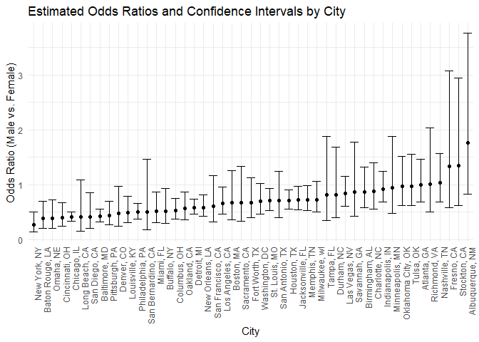
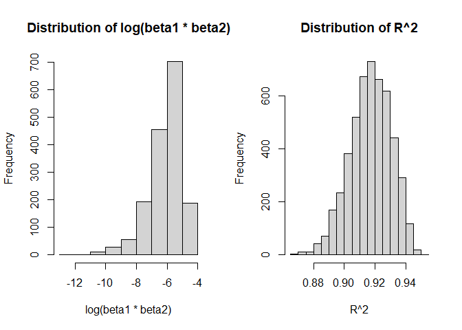
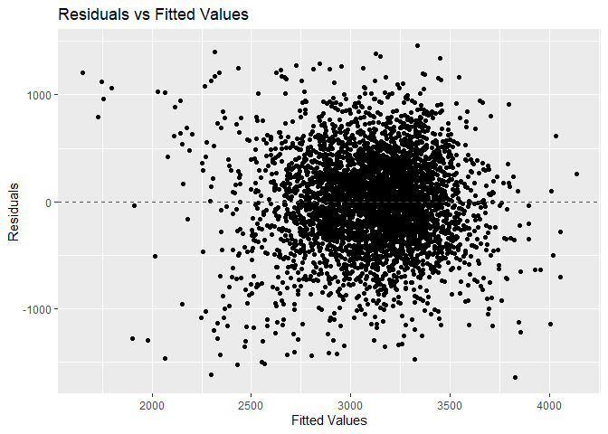
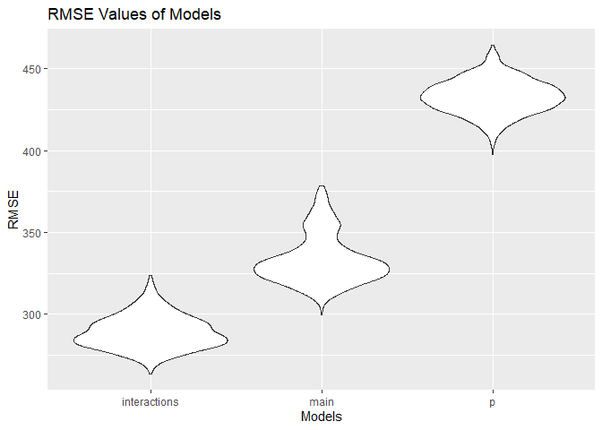

p8105_hw6_sjk3354
================
Sharon Kulali

``` r
# loading the needed library

library(tidyverse)
library(modelr)
library(broom)
library(purrr)
```

# Problem 1

``` r
# importing and cleaning the data

homicide_df = 
  read_csv("data/homicide-data.csv", na = c("", "NA", "Unknown")) |> 
  mutate(
    city_state = str_c(city, state, sep = ", "),
    resolution = case_when(
      disposition == "Closed without arrest" ~ "0",
      disposition == "Open/No arrest"        ~ "0",
      disposition == "Closed by arrest"      ~ "1"),
    resolution = as.numeric(resolution)
  ) |> 
  filter(!city_state %in% c("Dallas, TX", "Phoenix, AZ", "Kansas City, MO", "Tulsa, AL"),
         victim_race %in% c("White", "Black"))
```

``` r
# creating a Baltimore dataset

baltimore_df = 
  homicide_df |> 
  filter(city == "Baltimore" & state == "MD")
```

``` r
# fitting a logistic regression

logistic_model = 
  glm(resolution ~ victim_age + victim_sex + victim_race,
                      data = baltimore_df,
                      family = binomial) |> 
  tidy()
```

``` r
# obtaining the estimate and c.i. for comparing male victims to female

logistic_model |> 
  filter(term == "victim_sexMale") |> 
  mutate(
    OR = exp(estimate), 
    conf.high = exp(estimate + 1.96 * std.error),
    conf.low = exp(estimate - 1.96 * std.error)) |> 
  select(OR, conf.low, conf.high) |>
  knitr::kable(digits = 3)
```

|    OR | conf.low | conf.high |
|------:|---------:|----------:|
| 0.426 |    0.325 |     0.558 |

``` r
# creating a function to fit logistic regression and extract OR and c.i.

fit_logistic_model = function(homicide_df) {
  
  glm_model = glm(resolution ~ victim_age + victim_sex + victim_race,
                   data = homicide_df,
                   family = binomial)
  
  tidy_output = tidy(glm_model) |> 
    filter(term == "victim_sexMale") |> 
    mutate(
      OR = exp(estimate),
      conf.low = exp(estimate - 1.96 * std.error),
      conf.high = exp(estimate + 1.96 * std.error)
    ) |> 
    select(OR, conf.low, conf.high)
  
    return(tidy_output)
}
```

``` r
# creating a dataset using the function

city_dfs =
  homicide_df |> 
  nest(data = -city_state) |> 
  mutate(logistic_result = map(data, fit_logistic_model)) |> 
  unnest(logistic_result) |> 
  select(-data)

city_dfs |> 
  slice(1:5) |> 
  knitr::kable(digits = 3)
```

| city_state      |    OR | conf.low | conf.high |
|:----------------|------:|---------:|----------:|
| Albuquerque, NM | 1.767 |    0.831 |     3.761 |
| Atlanta, GA     | 1.000 |    0.684 |     1.463 |
| Baltimore, MD   | 0.426 |    0.325 |     0.558 |
| Baton Rouge, LA | 0.381 |    0.209 |     0.695 |
| Birmingham, AL  | 0.870 |    0.574 |     1.318 |

``` r
# plot showing the ORs and CIs for each city

city_dfs |> 
  mutate(city_state = fct_reorder(city_state, OR)) |> 
  ggplot(aes(x = city_state, y = OR)) +
  geom_point() +
  geom_errorbar(aes(ymin = conf.low, ymax = conf.high)) +
  labs(
    title = "Estimated Odds Ratios and Confidence Intervals by City",
    x = "City",
    y = "Odds Ratio (Male vs. Female)"
  ) +
  theme_minimal() +
  theme(axis.text.x = element_text(angle = 90, hjust = 1)) 
```

<!-- -->

The plot above shows the estimated adjusted odds ratio and confidence
intervals for solving homicides comparing male victims to female victims
in each city. The model adjusted for age and race and the odd ratios are
ordered from smallest to largest. You can see that the majority of
cities have an odds ratio value less than 1 indicating that crimes
involving male victims have smaller odds of being resolved compared to
those with female victims. Given that a majority of the confidence
intervals don’t contain 1, it can also be concluded that there is a
significant difference in resolution rates. Additionally, New York has
the smallest odds ratio while Albuquerque has the largest with half the
cities having a narrow confidence interval.

# Problem 2

``` r
# importing and cleaning the data

weather_df = 
  rnoaa::meteo_pull_monitors(
    c("USW00094728"),
    var = c("PRCP", "TMIN", "TMAX"), 
    date_min = "2022-01-01",
    date_max = "2022-12-31") |>
  mutate(
    name = recode(id, USW00094728 = "CentralPark_NY"),
    tmin = tmin / 10,
    tmax = tmax / 10) |>
  select(name, id, everything())

set.seed(123)
```

``` r
# getting the estimates from the bootstrap

boot_tidy =
  weather_df |> 
  modelr::bootstrap(n = 5000) |>
  mutate(
    models = map(strap, \(df) lm(tmax ~ tmin + prcp, data = df)),
    results = map(models, broom::tidy)
  ) |> 
  select(.id, results) |> 
  unnest(results) |> 
  select(.id, term, estimate) |> 
  filter(term != "(Intercept)") |> 
  pivot_wider(
    names_from = term,
    values_from = estimate
  ) |> 
  mutate(
    log_betas = log(tmin*prcp)
  )
```

    ## Warning: There was 1 warning in `mutate()`.
    ## ℹ In argument: `log_betas = log(tmin * prcp)`.
    ## Caused by warning in `log()`:
    ## ! NaNs produced

``` r
# getting the r squared from the bootstrap

boot_glance =
  weather_df |> 
  modelr::bootstrap(n = 5000) |>
  mutate(
    models = map(strap, \(df) lm(tmax ~ tmin + prcp, data = df)),
    results = map(models, broom::glance)
  ) |> 
  select(.id, results) |> 
  unnest(results) |> 
  select(.id, r.squared)
```

``` r
# plotting the estimates and r squares

par(mfrow = c(1, 2))

boot_tidy |> 
  mutate(log_betas = as.numeric(log_betas)) |> 
  pull(log_betas) |> 
  hist(main = "Distribution of log(beta1 * beta2)", xlab = "log(beta1 * beta2)")

boot_glance |> 
  mutate(r.squared = as.numeric(r.squared)) |> 
  pull(r.squared) |> 
  hist(main = "Distribution of R^2", xlab = "R^2")
```

<!-- -->

The above plot shows the distribution of 5000 bootstrap estimates for
the `r.squared` (r^2) and `log_betas` (log of beta_1 \* beta_2) from a
fitted regression. The regression model examined how the minimum
temperature and precipitation affect the maximum temperature. You can
see that the distributions are slightly skewed to the left on both
plots.

``` r
# getting the quantiles for the r squared and estimates

boot_glance |> 
  mutate(r.squared = as.numeric(r.squared)) |> 
  pull(r.squared) |> 
  quantile(c(0.025, 0.975)) |> 
  knitr::kable(digits = 3)
```

|       |    x |
|:------|-----:|
| 2.5%  | 0.89 |
| 97.5% | 0.94 |

``` r
boot_tidy |> 
  drop_na() |> 
  mutate(log_betas = as.numeric(log_betas)) |> 
  pull(log_betas) |> 
  quantile(c(0.025, 0.975)) |> 
  knitr::kable(digits = 3)
```

|       |      x |
|:------|-------:|
| 2.5%  | -9.063 |
| 97.5% | -4.619 |

We are 95% confident that the true r^2 value is between 0.889 and 0.941.
We are 95% confident that the true log(beta_1\*beta_2) is between -8.926
and -4.591. Additionally, there were 3363 Na values in the estimate when
the betas were multiplied and produced a negative value which you can’t
take the log of.

# Problem 3

``` r
# importing and cleaning the data

birthweight_df = 
  read_csv("data/birthweight.csv", na = c("", "NA", "Unknown")) |> 
  mutate(
    babysex = case_when(
      babysex == "1" ~ "male",
      babysex == "2" ~ "female"),
    babysex = factor(babysex),
    frace = case_when(
      frace == "1" ~ "White",
      frace == "2" ~ "Black",
      frace == "3" ~ "Asian",
      frace == "4" ~ "Puerto Rican",
      frace == "8" ~ "Other",
      frace == "9" ~ "Unknown"),
    frace = factor(frace),
    malform = case_when(
      malform == "0" ~ "absent",
      malform == "1" ~ "present"),
    malform = factor(malform),
    mrace = case_when(
      mrace == "1" ~ "White",
      mrace == "2" ~ "Black",
      mrace == "3" ~ "Asian",
      mrace == "4" ~ "Puerto Rican",
      mrace == "8" ~ "Other"),
    mrace = factor(mrace),
  )
```

``` r
# proposed regression model

p_lm = lm(bwt ~ babysex + gaweeks + momage + mrace + delwt, data = birthweight_df)
```

``` r
# plot of model residuals against fitted values

birthweight_df =
  birthweight_df |> 
  modelr::add_predictions(p_lm) |> 
  modelr::add_residuals(p_lm) 

ggplot(birthweight_df, aes(x = pred, y = resid)) +
  geom_point() +
  geom_hline(yintercept = 0, linetype = "dashed", color = "red") +
  labs(title = "Residuals vs Fitted Values",
       x = "Fitted Values",
       y = "Residuals")
```

<!-- -->

I propose that birth weight is impacted by the baby’s sex, gestational
age, mother’s age at delivery, mother’s race, and mother’s weight at
delivery. I’ve hypothesized this model based on data that shows these
factors influencing the baby’s birth weight. The plot above shows the
model residuals against fitted values. Overall, they’re pretty
symmetrically distributed, tending to cluster towards the middle of the
plot.

``` r
# other models to compare to

main_lm = lm(bwt ~ blength + gaweeks, data = birthweight_df)

interactions_lm = lm(bwt ~ blength + bhead + babysex + (blength * bhead * babysex), data = birthweight_df)
```

``` r
# creating a cross validation dataset

cv_df =
  birthweight_df |> 
  crossv_mc(n = 1000) |> 
  mutate(
    train = map(train, as_tibble),
    test = map(test, as_tibble)
  )
```

``` r
# creating a function for linear regression

lin_mod_funct = function(df) {
  
  lm(y ~ x, data = df)

}
```

``` r
# creating a dataset for the cross validation results

cv_restults =
  cv_df |> 
  mutate(
    p_fit = map(train, \(df) lm(bwt ~ babysex + gaweeks + momage + mrace + delwt, data = df)),
    main_fit = map(train, \(df) lm(bwt ~ blength + gaweeks, data = df)),
    interactions_fit = map(train, \(df) lm(bwt ~ blength + bhead + babysex + (blength * bhead * babysex), data = df))
  ) |> 
  mutate(
    rmse_p = map2_dbl(p_fit, test, \(mod, df) rmse(mod, df)),
    rmse_main = map2_dbl(main_fit, test, \(mod, df) rmse(mod, df)),
    rmse_interactions = map2_dbl(interactions_fit, test, \(mod, df) rmse(mod, df))
  )
```

``` r
# looking at the rmse values

cv_restults |> 
  select(starts_with("rmse")) |> 
  pivot_longer(
    everything(),
    names_to = "model_type",
    values_to = "rmse",
    names_prefix = "rmse_"
  ) |> 
  group_by(model_type) |> 
  summarise(m_rmse = mean(rmse)) |> 
  knitr::kable(digits = 3)
```

| model_type   |  m_rmse |
|:-------------|--------:|
| interactions | 288.986 |
| main         | 333.316 |
| p            | 433.233 |

``` r
cv_restults |> 
  select(starts_with("rmse")) |> 
  pivot_longer(
    everything(),
    names_to = "model_type",
    values_to = "rmse",
    names_prefix = "rmse_"
  ) |> 
  ggplot(aes(x = model_type, y = rmse)) +
  geom_violin() +
  labs(title = "RMSE Values of Models",
       x = "Models",
       y = "RMSE")
```

<!-- -->

I compared my model to two other models using cross-validated prediction
errors. The first one focused on the main effects of length at birth and
gestational age on baby’s birth weight. The second one looked at head
circumference, length, sex, and all these interactions on birth weight.
This model has the lowest value (289) of the Root Mean Squared Error
(rmse) indicating that it does the best job at predicting the target
value while my proposed model had the highest rmse value (433). This is
demonstrated in the plot above where you can see the drastic difference
between my proposed model and the other models.
